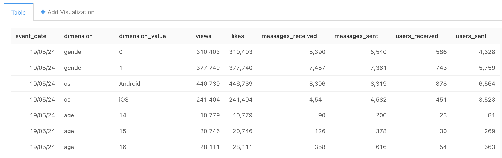

# ETL-pipeline

## Оглавление:

[1. Описание проекта.](#1-описание-проекта) 
[2. Краткая информация о данных.](#2-краткая-информация-о-данных) 
[3. Этапы работы над проектом.](#3-этапы-работы-над-проектом) 
[4. Использованные инструменты и библиотеки.](#4-использованные-инструменты-и-библиотеки) 

### 1. Описание проекта.

**ETL (Extract, Transform, Load)** - извлечение, преобразование, загрузка. Процесс, с помощью которого данные из нескольких систем объединяются в единое хранилище данных. 

Целью данного проекта является построение ETL-пайплайна по следующему сценарию:

Параллельно обрабатываются две таблицы: лента новостей (feed_actions) и сообщения (message_action).

Из таблицы feed_actions для каждого пользователя считаем число просмотров и лайков контента, из таблицы message_actions для каждого пользователя считаем, сколько он получает и отсылает сообщений, скольким людям он пишет, сколько людей пишут ему. Для каждой выгрузки создается отдельный таск.

Далее, полученные две таблицы объединяем в одну и считаем все эти метрики в разрезе по полу, возрасту и платформе (операционной системе) - отдельным таском на каждый срез.

**Граф в Airflow:**

**Отcлеживание выполнения:**

Финальные данные записываем в отдельную таблицу в ClickHouse. Эта таблица каждый день должна пополняться новыми данными.

**Структура финальной таблицы:**

* `event_date` - дата
* `dimension` - название среза
* `dimension_value` - значение среза
* `views` - число просмотров
* `likes` - число лайков
* `messages_received` - число полученных сообщений
* `messages_sent` - число отправленных сообщений
* `users_received` - от скольких пользователей получили сообщения
* `users_sent` - скольким пользователям отправили сообщение

**Финальная таблица в Redash:**

### 2. Краткая информация о данных.

Данные содержат информацию о ленте новостей и мессенджере и обновляются в режиме реального времени. В ClickHouse находятся две таблицы: по ленте новостей и по мессенджеру. Поля содержат информацию о действиях пользователей (просмотрах и лайках), постах, отправленных и полученных сообщениях, о поле, стране и городе и т.п.

⬆️[К оглавлению](#оглавление)

### 3. Этапы работы над проектом.
1. Создание тасков выгрузки данных.
2. Создание таска для объединения таблиц.
3. Создание тасков для получения нужных срезов.
4. Создание таска для объединения срезов в финальную таблицу.
5. Выгрузка полученных данных в ClickHouse.
6. Запуск DAGа.
 

⬆️[К оглавлению](#оглавление)

### 4. Использованные инструменты и библиотеки.
* Apache Airflow
* ClickHouse
* matplotlib==3.3.2 
* pandahouse==0.2.7 
* pandas==2.0.2

⬆️[К оглавлению](#оглавление)